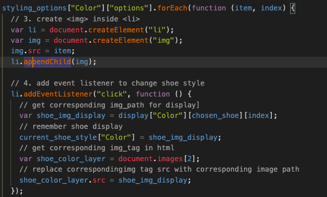

# Procesverslag
**Auteur:** Nikki van der Vaart

**De opdrachten:** [opdracht 1](opdracht1/index.html) en [opdracht 2](opdracht2/index.html)

Markdown is een simpele manier om HTML te schrijven.  
Markdown cheat cheet: [Hulp bij het schrijven van Markdown](https://github.com/adam-p/markdown-here/wiki/Markdown-Cheatsheet).

Nb. De standaardstructuur en de spartaanse opmaak van de README.md zijn helemaal prima. Het gaat om de inhoud van je procesverslag. Besteedt de tijd voor pracht en praal aan je website.

Nb. Door *open* toe te voegen aan een *details* element kun je deze standaard open zetten. Fijn om dat steeds voor de relevante stuk(ken) te doen.

## Bronnenlijst
1. [https://bennettfeely.com/clippy/](https://bennettfeely.com/clippy/)

2. [https://www.youtube.com/watch?v=cXxsE1_QrfE](https://www.youtube.com/watch?v=cXxsE1_QrfE)

3. [https://css-tricks.com/animating-with-clip-path/](https://css-tricks.com/animating-with-clip-path/)

4. [https://www.w3schools.com/cssref/trycss3_transform-origin_inuse.htm](https://www.w3schools.com/cssref/trycss3_transform-origin_inuse.htm)

5. https://blog.bitsrc.io/css-clamp-the-responsive-combination-weve-all-been-waiting-for-f1ce1981ea6e

6. https://stackoverflow.com/questions/34913675/how-to-iterate-keys-values-in-javascript

7. https://www.geeksforgeeks.org/ways-iterating-array-javascript/

8. https://www.javascripttutorial.net/dom/manipulating/remove-all-child-nodes/

9. https://blog.logrocket.com/localstorage-javascript-complete-guide/#:~:text=localStorage%20is%20a%20property%20that,the%20browser%20window%20is%20closed.

10. https://www.w3schools.com/jsref/jsref_gettime.asp

11. https://stackoverflow.com/questions/18967532/window-location-reload-not-working-for-firefox-and-chrome

## Opdracht 1 plan

  
uitwerken na schetsen idee (voor week 2)

  ### Je storyboard:
  

  ### Je ambitie: 
  Aan deze technieken/punten wil ik werken:
  - Hoe ik tekst kan verwijderen zodat het lijkt dt iemand de logo is aan het eten. 
  - het effect/animatie dat de logo in half breekt 
  - masks gebruiken met css
  - pseudo elements
 

## Opdracht 1 reflectie

  
uitwerken bij afronden opdracht (voor week 3)

  ### Je uitkomst - karakteristiek screenshot(s):
  
  
  

  ### Dit ging goed/Heb ik geleerd: 
  Een ding dat goed ging was de erste gedeelte van de animatie waar de KIT afbreekt van de KAT. Ik heb een clip path gebruikt om gedeeltes van de eerste T en tweede K te verwijderen. Ik dacht dat het lastig zou zijn om het te doen maar het ging best wel goed. Ik had een link gevonden waar de nummers in de clip path worden gegeven door het maken van de vorm dat je wilt.

  

  ### Dit was lastig/Is niet gelukt:
  Een ding dat lastig was was het gebruiken van clip paths om de bite marks te maken. Ik had elke vorm gemaakt maar niks lukte mij. Dus omdat ik de mogelijkheid had om li's te gebruiken om de crumbs te maken had ik bedacht om die te gebruiken als een soort "cover" op de KAT en vandaar circles maken die like op de bite marks. 

  

## Opdracht 2 plan

  
uitwerken na schetsen idee (voor week 4)

  ### Je ontwerp:
  

  ### Je ambitie: 
  Aan deze technieken/punten wil ik werken:
  - een soort "storage" maken met js om de favorites lijst te kunnen maken
  - layers gebruiken om de schoen te aanpassen met kleur, design etc.
  - in het algemeen meer leren met js, en veel daarmee spelen. 

## Opdracht 2 test

  
uitwerken na testen (week 6/7)

  Neem minimaal 5 bevindingen op:

  ### Bevinding 1:
  Voor de favorites pagina, wou ik dat alle schoenen die favorited waren direct te zien was toen de pagina was aan het laden. Ik wou niet een knop toevoegen die zou je favorites laten zien, maar dat het direct te zien was.  Ik twijfelde erg met hoe ik dit moest oplossen.

  #### oplossing:
  In het eind heb ik window.onload gebruikt om dit te bereiken. Daarin kon ik de systeem vertellen om direct na het laden, de functie te roepen die alle schoenen vindt en om het te displayen.

  

 ### Bevinding 2:
  Het probleem was toen ik de grid options event listener getriggered, de functie zou de layer's image source toewijzen aan dezelfde .png file-path die gebruikt was voor de grid optie zelf. Ik moest een oplossing vinden die de grid options .png zou koppelen aan correcte display .png file.

  #### oplossing:
  De opplossing was om een andere Map/JSON like object te maken, deze zou de correcte display images bewaren afhankelijk op de order van hoe de grid option images waren bewaard in een lijst. Dit betekent dat we de index kunnen gebruiken van de .png file path in de grid option lijst om de .png file path te krijgen voor display.

  
  
  

  ### Bevinding 3:
  Het probleem was hoe de schoenen gefiltered kunnen worden. Ik moest overnadenken hoe ik de filter zou bijhouden. 

  #### oplossing:
  Ik had het idee om een variable te maken waarin ik de shoe styles die de user wilt zien zal opslaan. Het functie dat de lijst van schoenen displays (toont) gebruikt die variable om de correcte schoenen te tonen. Sinds het functie dat de lijst van schoenen toont, die specifieke variabele gebruikt, voor het laden en herladen van het pagina moest localStorage in het begin van .js file ook worden toegewezen naar de variable om alle schoenen te tonen.

  
  
  

## Opdracht 2 reflectie

  
uitwerken bij afronden opdracht (voor week 8)

  ### Je uitkomst - karakteristiek screenshot(s):
  

  ### Dit ging goed/Heb ik geleerd: 
  Opdracht 2 was zeker een uitdaging maar wel veel geleerd. Iets dat goed ging en waarvan ik veel geleerd heb, was het gebruiken van Map in Javascript. Ik wist niet dat dit mogelijk was, waarbij je een soort storage achtig object kan maken. Dit was super handig om te hebben in mijn code, want ik kon een soort "filing systeem" maken met verschillende variables waardoor ik de lijsten die nodig afhankelijk van de variabelen kan pakken.

  

  ### Dit was lastig/Is niet gelukt:
  In mijn favorites pagina is er de mogelijkheid om de schoenen te verwijderen door te slepen naar de prullenbak icoon. Maar als de schoen een stack van layers (als het een kleur heeft, design, of lace kleur) dan sleept de afbeeldingen niet mee en krijg je een wereld icoon te zien in plaats van alle afbeeldingen. Dit probleem was alleen te zien met een stack, als de schoen alleen doe schoen afbeelding was dan zie je die afbeelding wel tijdens het slepen. Ook kon ik niet de remove button responsive maken :(

  

